  <samp>用代码构建梦想 💖</samp>

---

### 🌸 关于我

- 🎯 **后端开发**为主，专注 Java / C / C++，喜欢简洁优雅的代码
- 🎨 相信代码要有温度，系统设计是科学与艺术的结合
- 🌱 持续学习中 —— *种一棵树最好的时间是十年前，其次是现在*

### 🛠 技术栈

  
  
  
  
  
  
  

### 📌 顶置仓库

  

### 🔥 贡献年视图

  

---

  

<!--
  🌸 如果你看到了这里，祝你今天开心~
-->
